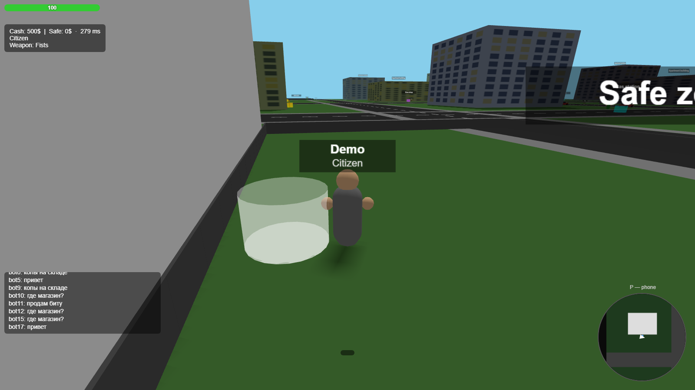
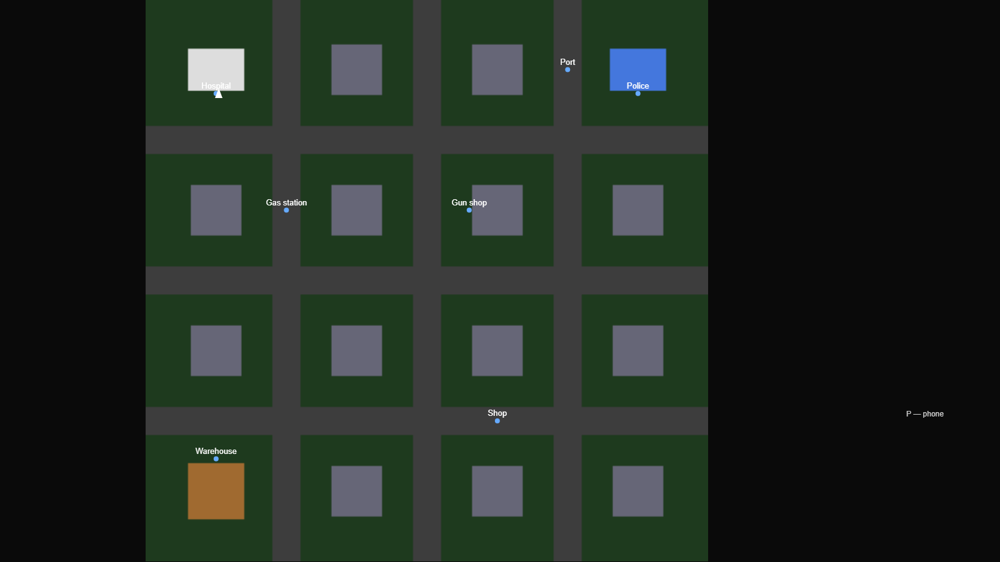
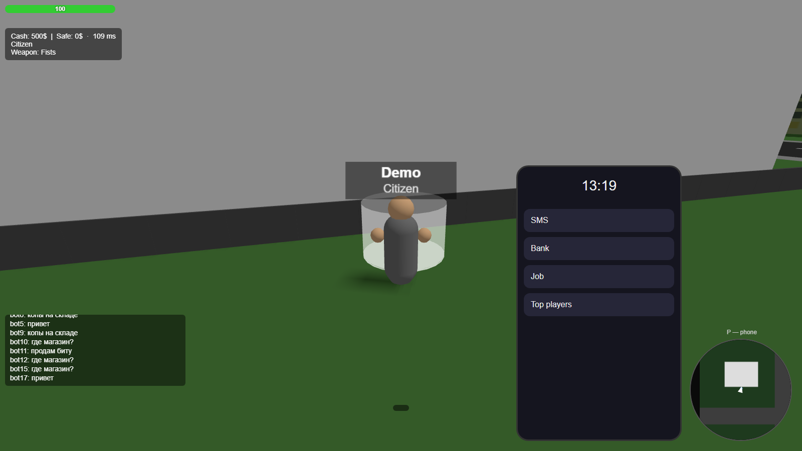

# MMO City

[](https://github.com/smadrom/mmo-city/actions/workflows/ci.yml)
[](LICENSE)

A browser-based 3D MMO for up to 100 players in a shared city: apartment rentals, fist fights and firearms, drivable cars, player-police with a wanted system, and zombies. Runs entirely in the browser — no downloads, no plugins.



<p align="center">
  
  
</p>

## Features

- **Shared world for 100 players** — one Colyseus room, server-authoritative state
- **Accounts & characters** — email+password registration (scrypt), up to 8 characters per account with independent nick, role and progress
- **Two roles** — Citizen and Police: cops see wanted players marked in red, arrest them by standing close, earn salary and bonuses
- **Combat** — fists, bat, pistol, rifle; hitmarkers, damage direction indicator, tracers, recoil; weapons drop from corpses as pickups
- **Cars** — nitro on Shift, dynamic camera, engine sound, tire marks, wall bounce; client-side prediction for your own car, adaptive catmull-rom interpolation for others
- **Economy** — courier jobs with distance-based pay, apartment rent with a personal safe, bank transfers (offline players get credited on login), cash drops on death
- **Wanted system** — kill someone and get a bounty on your head; bounty hunters earn $25 per wanted kill
- **Zombies** — roam the cemetery, chase and attack, drop $10–29
- **Social** — in-game phone with SMS threads (with offline delivery and unread badge), leaderboard
- **World** — day/night cycle (10 minutes), building shadows and lit windows, minimap + full-screen map with POIs, kill feed, chat, WebAudio sounds
- **Resilience** — transparent reconnect (10s window): the game continues without re-login on connection drops
- **Localization** — RU/EN switch on the login screen
- **Touch support** — virtual joystick, swipe camera, on-screen buttons

## Quick start

```bash
npm install
npm run dev        # server (ws://localhost:2567) + client (http://localhost:5173)
```

Open http://localhost:5173 and enter an email and password — the first login registers the account (no email confirmation needed). Then create a character (nickname + Citizen/Police role) or pick an existing one.

The client connects to `ws://<page-host>:2567`; override with the `VITE_SERVER_URL` env variable.

## Controls

- WASD — move, Shift — run (nitro in a car), mouse — camera
- Wheel — zoom, RMB — aim (narrows FOV)
- LMB (after pointer lock) — attack
- E — enter/exit car, take cargo, rent, safe
- Tab — player list, P — phone, M — map, Esc — settings, F3 — FPS/ping, N — mute

## Tech stack

- `shared/` — constants, city map, physics (used by both server and client)
- `server/` — Node.js, Colyseus room, game systems, SQLite (WAL) persistence
- `client/` — Three.js renderer, input, HUD, Vite build

Load test on a local machine: 100/100 bots in one room, ~7% CPU of a single core, stable memory (~115 MB).

## Commands

- `npm test` — unit and integration tests (46 shared + 234 server)
- `npm run typecheck` — strict TypeScript across all workspaces
- `npm run build` — production client build
- `npm run loadtest -w server` — 100 bots against a local server (requires a clean `server/game.db`; delete the file to re-run)

## Deployment

Docker setup with nginx, Let's Encrypt and an admin panel lives in `deploy/` — see [deploy/README.md](deploy/README.md). Client and server must be deployed together (the state schema changes between versions).

## Known limitations

- Zombies don't pathfind around buildings (they slide along walls).
- See [docs/manual-checklist.md](docs/manual-checklist.md) for the full manual QA checklist.

## License

[MIT](LICENSE)
